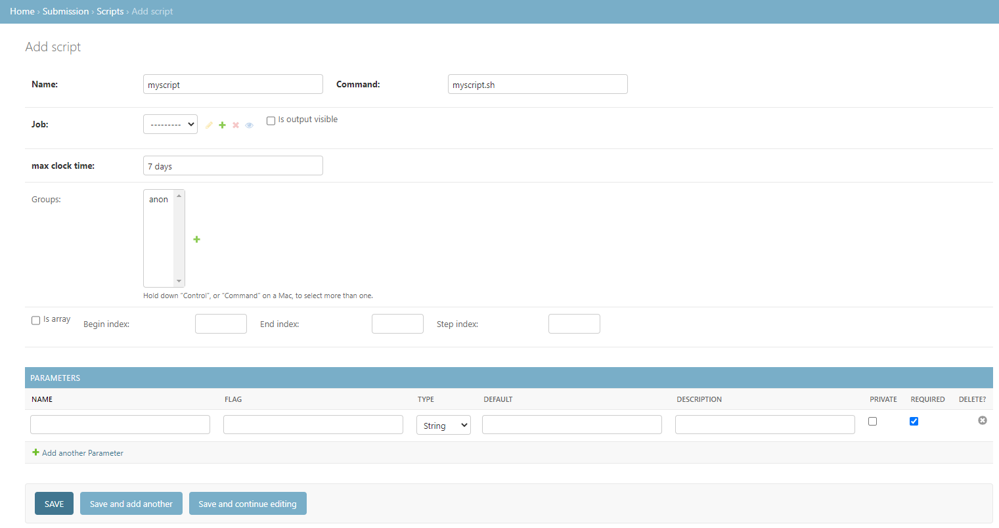
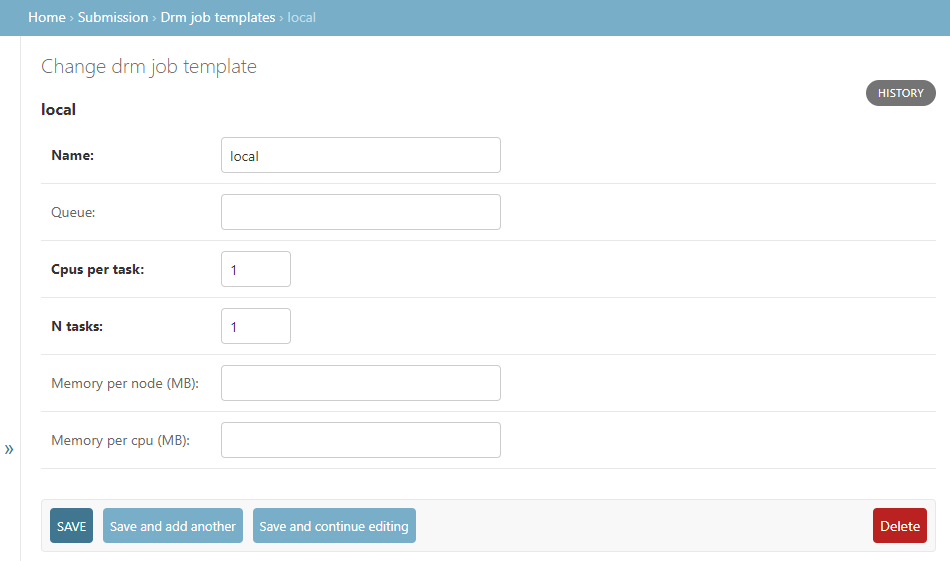
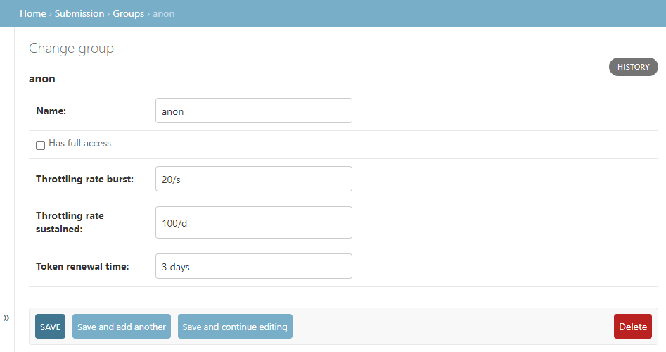
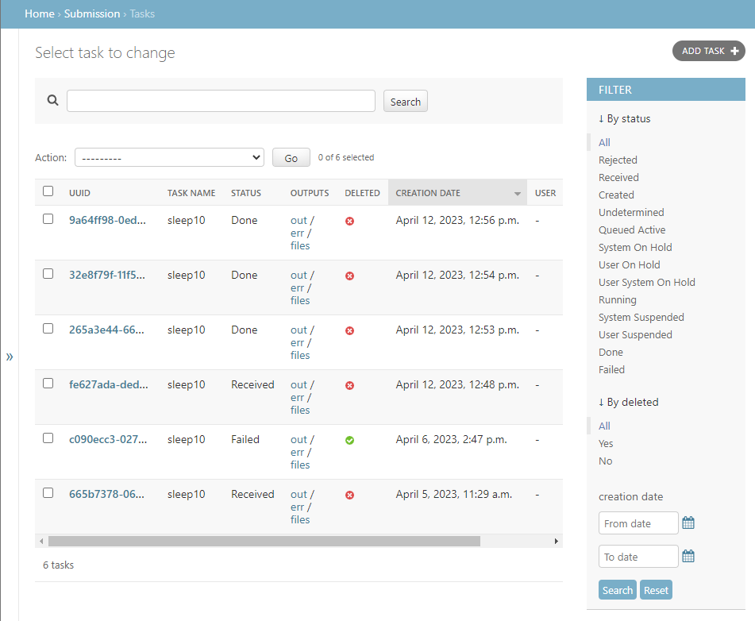

.. _admin-usage:

Admin Usage
===========

DRMAAtic includes an administration user interface that mainly aims to manage the resources of the DRMAAtic model. 
Before entering into this user interface, is necessary to create a superuser like shown below and login through the 
``/admin`` URI.


Create admin superuser
---------------------------

To enter to the Admin User Interface, you must first create a user for this with::

    $ python manage.py createsuperuser --noinput --username <your_admin_username> --email <your_email_address>

Then, you can access it through ``http://<YOUR_WEB_SERVER_URI>/admin```


Create a Script
---------------------------

Now, for the integration process, is necessary to create the available Scripts which the Tasks will 
use as a base to run a job inside the DRM. 

For this purpose, the user interface provides a form to create that script as
shown below. In this form, is required to specify the name, command to
execute, DRM job template, and max clock time for the execution. The name will
be required to specify which script to use when a task is created. The command
will be searched inside the ``CLUSTER.SUBMISSION_SCRIPT_DIR`` of the JSON
configuration file unless an absolute path is provided.



The DRM job template
can be added in its own form as in below that allows defining the resources
that the execution of this script will need. Also, the max clock time has to be a
time expression of `pytimeparse <https://github.com/wroberts/pytimeparse>`_.



Additionally, the user groups that can run this script can be specified inside the form. If none of them is selected, 
then any user can create a task from this script. Optionally, this script can be defined as a job array with the begin, end, and step indexes. 
Finally, in the same form, the input parameters of the script can be defined by choosing its name, flag, type, default value, description, private status, and if required.



Furthermore, DRMAA also provides a view in the user interface to list, search, and filter tasks as shown below.

